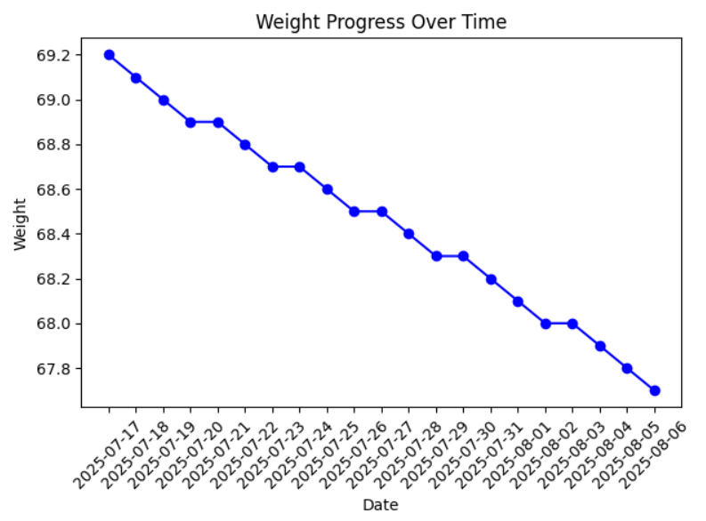

# 🏋️‍♂️ Fitness Tracker

A simple desktop application built with Python and Tkinter to help you track your daily weight and workout activity. Visualize your progress using graphs powered by Matplotlib and manage your health goals with ease.

---

## 📌 Features

- 📆 Log daily weight entries
- ✅ Record whether you did your workout or not
- 📈 Visualize weight trends over time (line chart)
- 🥧 View workout completion ratio (pie chart)
- 💾 Data stored in `.csv` files for easy access and editing
- 🖥️ User-friendly GUI using Tkinter

---

## ⚙️ Tech Stack

- **Language:** Python 3.x
- **GUI:** Tkinter
- **Data Handling:** pandas
- **Data Visualization:** matplotlib
- **Storage:** CSV files
- 

## 📁 Project Structure


fitness_tracker/
 ui.py             # Main GUI window for tracking and visualization
 weight.py         # Shows weight progress graph
 workout.py        # Shows workout completion pie chart
 weight.csv        # Stores date and weight (auto-created if not present)
 workout.csv       # Stores date and workout status (Yes/No)
 README.md         # Project documentation


## 🖼️ Screenshots

### Main UI Window


### Weight Progress Graph


### Workout Completion Chart


## 🖥️ Requirements

- **Python Version:** 3.x
- **Required Libraries:**
  
  pip install pandas matplotlib


## 🚀 How to Run

1. Ensure all files (`ui.py`, `weight.py`, `workout.py`) are in the same directory.

2. Open a terminal in the project folder and run:
   ```bash
   python ui.py

## Author

Name: Rahul Chandran
LinkedIn: Rahul Chandran
